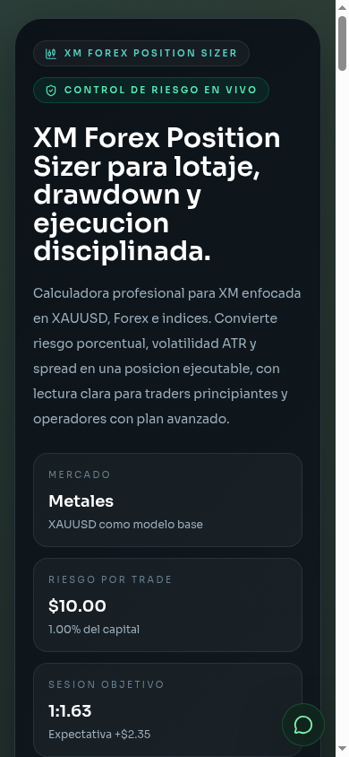

# XM Forex Position Sizer

Calculadora web para traders que operan con XM y necesitan convertir un escenario de mercado en un ticket de riesgo ejecutable. La herramienta estima lote sugerido, stop loss, take profit, coste de spread, drawdown probable, expectativa y progreso hacia una meta de capital.

Sitio publicado: [xmsizer.vercel.app](https://xmsizer.vercel.app/)




## Enfoque del proyecto

- Branding unificado como `XM Forex Position Sizer` en interfaz, reporte copiable, metadatos y despliegue.
- Diseño orientado a terminal de trading: lectura rápida, contraste alto, métricas clave arriba y acciones operativas visibles.
- Flujo de trabajo separado por ventanas completas para `Plan de trading` y `Manual operativo`, sin modales superpuestos al dashboard.
- Soporte para cuentas XM `micro` y `standard`.
- Modelos base por mercado:
  - `Forex`: referencia tipo `EURUSD`.
  - `Metales`: referencia tipo `XAUUSD`.
  - `Índices`: referencia tipo `US30`.
- SEO, Open Graph, Twitter Cards, favicon, `robots.txt`, `sitemap.xml`, `manifest` y cabeceras de seguridad para Vercel.

## Qué calcula

- Riesgo por trade en USD a partir del capital y porcentaje de riesgo.
- Lote sugerido considerando spread estimado dentro del riesgo.
- Stop loss y take profit desde ATR o desde un modo manual.
- Ratio técnico y ratio neto.
- Coste del spread y reward neto.
- Drawdown probable ante una racha de pérdidas.
- Kelly sugerido, expectativa por trade y trades estimados para llegar a la meta.
- Presupuesto diario de pérdida según el plan de trading guardado.

## Flujo de uso actual

1. Abre `Plan de trading` para fijar capital, riesgo base, mercado, cuenta y meta mensual.
2. Guarda ese perfil en local y aplícalo al dashboard cuando quieras reiniciar la sesión desde una base consistente.
3. Ajusta en el panel principal el escenario vivo: `ATR`, `spread`, modo `ATR` o `Manual`, `win rate` y objetivo de equity.
4. Revisa ticket, analítica de supervivencia y bitácora antes de ejecutar.
5. Usa `Manual operativo` como referencia extensa del flujo, fórmulas y errores comunes.

## Para quién sirve

### Trader principiante

- Operar cuenta micro con control más fino.
- Aprender a no sobredimensionar una posición.
- Validar el impacto real del spread antes de abrir la orden.

### Trader con más experiencia

- Cruzar win rate esperado con reward neto.
- Comparar escenarios ATR vs manual.
- Ver drawdown, expectativa y límite diario desde el mismo panel.

## Stack real del repositorio

- `React 19`
- `TypeScript`
- `Vite 6`
- `Tailwind CSS 4`
- `lucide-react`

No hay backend ni variables de entorno obligatorias para correr el proyecto en local.

## Estructura principal

```text
.
├── index.html
├── vercel.json
├── public/
│   ├── favicon.svg
│   ├── og-image.png
│   ├── preview-desktop.png
│   ├── preview-mobile.png
│   ├── robots.txt
│   ├── site.webmanifest
│   └── sitemap.xml
└── src/
    ├── App.tsx
    ├── components/
    │   ├── TradingPlanWorkspace.tsx
    │   ├── TechnicalManual.tsx
    │   ├── ConfigPanel.tsx
    │   ├── ResultsDisplay.tsx
    │   ├── AnalyticsPanel.tsx
    │   └── HistoryPanel.tsx
    ├── hooks/useRiskCalculator.ts
    ├── lib/marketProfiles.ts
    ├── lib/tradingPlan.ts
    ├── lib/persistence.ts
    └── types.ts
```

## Lógica principal del proyecto

- `src/hooks/useRiskCalculator.ts`: convierte la configuración actual en ticket ejecutable, expectativa, drawdown y métricas de supervivencia.
- `src/lib/tradingPlan.ts`: valida si el plan es aplicable en XM, calcula el lote estimado mínimo, genera sugerencias por mercado/cuenta y proyecta el ritmo diario de la meta.
- `src/lib/persistence.ts`: sanitiza `config`, `plan` y `history` antes de leer o escribir en `localStorage`.
- `src/App.tsx`: coordina persistencia, cálculo principal y navegación entre `dashboard`, `manual` y `plan`.

## Persistencia local

La app guarda tres bloques en `localStorage`:

- `xm_forex_sizer_config`
- `xm_forex_sizer_plan`
- `xm_forex_sizer_history`

Cada bloque pasa por saneamiento defensivo antes de rehidratarse para evitar estados rotos o valores fuera de rango.

## Uso local

```bash
npm install
npm run dev
```

La app queda disponible en `http://localhost:3000` o en el siguiente puerto libre que Vite detecte.

## Scripts útiles

- `npm run dev`: servidor local.
- `npm run lint`: chequeo TypeScript sin emitir archivos.
- `npm run build`: build de producción.
- `npm run preview`: vista previa del build.
- `npm run check`: corre `lint` y `build`.

## Cómo usar la calculadora

1. Define el capital disponible.
2. Selecciona cuenta `micro` o `standard`.
3. Elige mercado: `metals`, `forex` o `indices`.
4. Ajusta riesgo, win rate y spread.
5. Usa `ATR adaptativo` o `Manual`.
6. Revisa el ticket de ejecución y copia el reporte si vas a compartirlo.
7. Guarda la sesión en bitácora si quieres comparar escenarios.

## Validaciones importantes de la app

- El plan de trading se evalúa contra mínimos operativos de XM antes de permitir su aplicación.
- El progreso a meta se calcula desde el capital base del plan, no como simple proporción `capital / target`.
- La lectura de `trades por día` distingue entre `0` trades necesarios y ausencia de expectativa positiva, para no confundir objetivo cumplido con inviabilidad.
- Si cambias de mercado, la app recarga `ATR`, `spread`, `SL`, `TP` y `RRR` base de ese perfil antes de recalcular.

## Supuestos importantes

- Los cálculos son un modelo operativo, no una promesa de resultados.
- `Forex` está orientado a pares principales cotizados en USD.
- `Metales` usa como referencia `XAUUSD`.
- `Índices` usa un modelo conservador y requiere validar el valor por punto del símbolo real en XM.
- Si cambian spread, volatilidad o estructura del instrumento, vuelve a calcular antes de entrar.

## Recomendaciones operativas

- Para aprendizaje, empieza en cuenta micro y riesgo de `0.5%` a `1.0%`.
- Usa el win rate como dato estadístico propio, no como intuición.
- Si el ratio neto sale débil, no fuerces la operación cambiando el lote.
- Guarda la sesión antes de ejecutar y compárala con el resultado real después.

## Licencia y atribución

Este proyecto se comparte bajo la licencia **Creative Commons Atribución (CC BY)**.

Puedes reutilizarlo, adaptarlo y publicarlo, incluso con fines comerciales, siempre que mantengas una atribución visible a [Wuilmer Bolívar](https://www.linkedin.com/in/wuilmerbolivar/) en el código, la documentación o el producto derivado.
